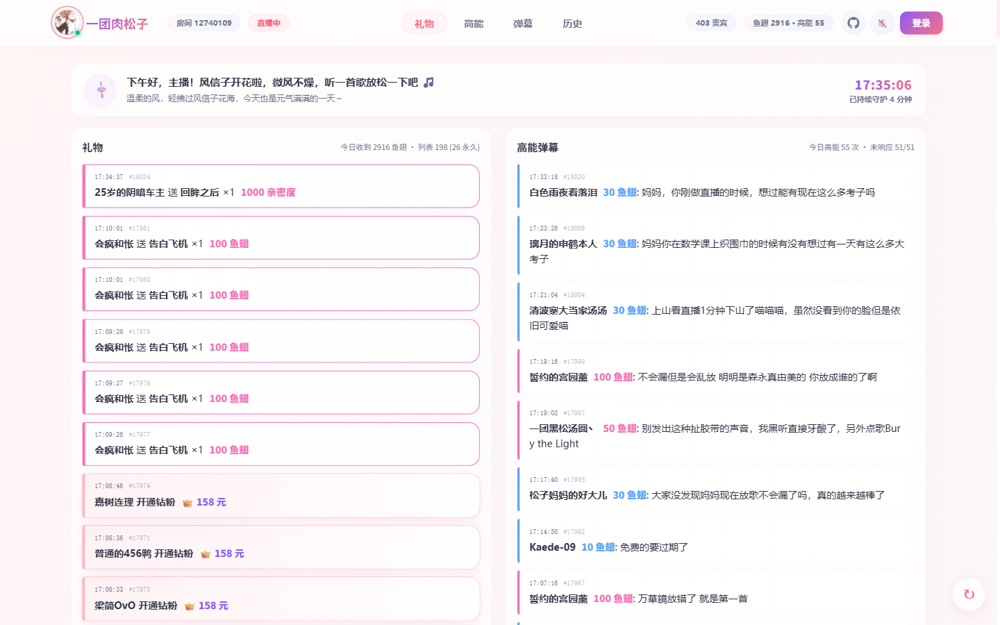
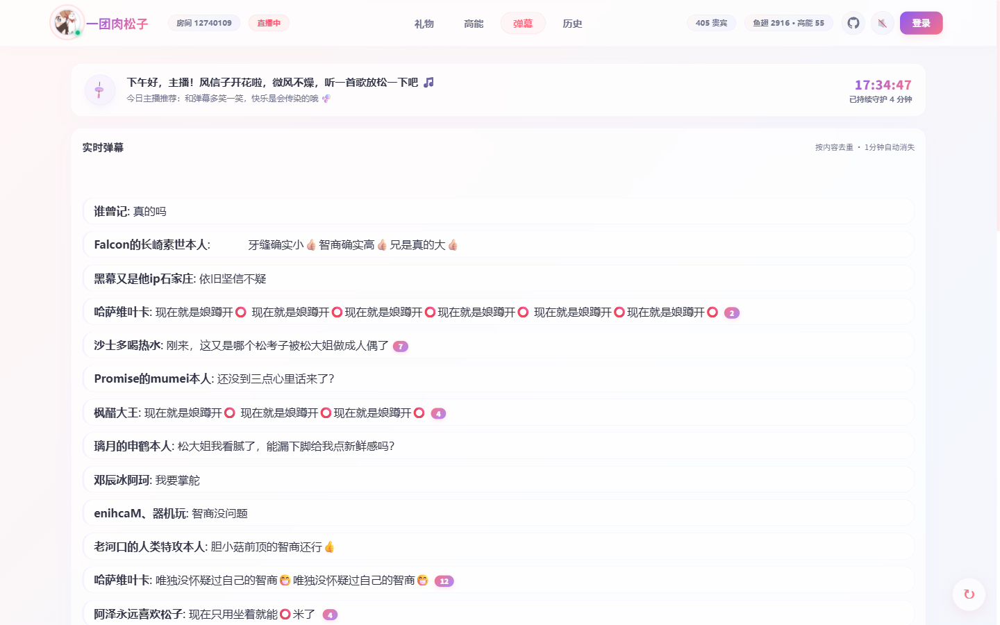
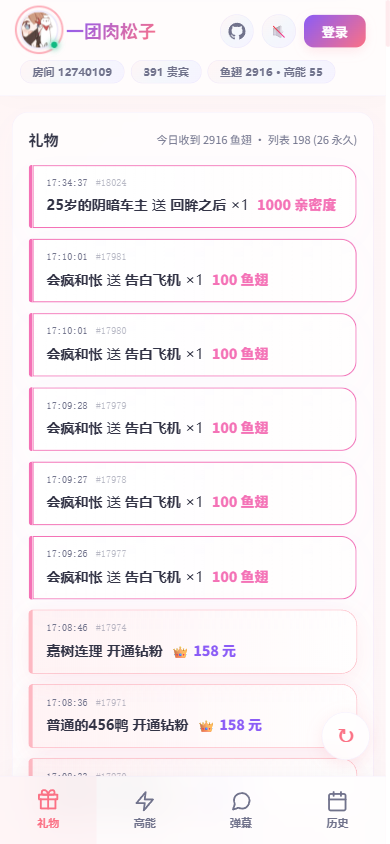
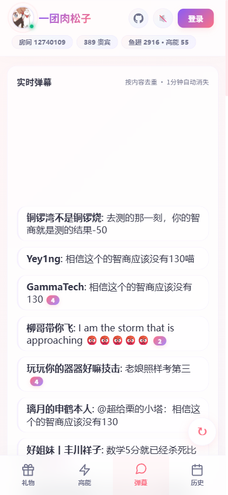

# Hyacinth Sentry · 风信子哨兵

> 一个给斗鱼户外主播自用的"第二屏"小工具 —— 在汹涌的弹幕流中替你筛信号、留底。
> **Hyacinth Sentry** 取意如蓝色风信子般的恒久守护，像哨兵一样为你捕捉那些闪光的贝壳。

直播间右下角那一片刷屏弹幕谁都看不过来，大礼物连击会被后面的顶走，高能弹幕里又掺杂着大量复读和宝箱派生事件 —— 而主播的注意力又往往不在屏幕上。本项目不是再做一个弹幕窗口，而是替你 **筛信号 + 留底**：手机浏览器、第二台设备、平板，任何一块屏放在视线随手能瞥到的地方即可。

---

## 目录

- [免责声明](#免责声明)
- [界面预览](#界面预览)
- [核心能力](#核心能力)
- [快速开始](#快速开始)
- [配置项](#配置项)
- [使用说明](#使用说明)
- [维护命令](#维护命令)
- [技术栈](#技术栈)
- [Roadmap](#roadmap)
- [已知问题](#已知问题)
- [致谢](#致谢)
- [License](#license)

---

## 免责声明

> [!WARNING]
> 本项目仅供 **主播本人** 或经主播明确授权的助手，在 **自有直播间** 进行弹幕信号筛选与留底使用。请勿用于其他直播间的数据采集、二次分发或商业用途。

> [!IMPORTANT]
> 协议层直连 `danmuproxy.douyu.com:8601`，匿名加入指定房间的公开广播组。任何对第三方直播间的批量监控、对斗鱼接口的高频拉取、或对采集数据的对外分发，都不在本项目的预期使用范围内，使用者自行承担相应责任。

> [!CAUTION]
> 部署到公网前，**必须设置 `DOUYU_ADMIN_PASSWORD` 环境变量**。未设置时默认密码为 `admin`，会导致任何人都能登录主播模式并清空数据。

---

## 界面预览

线上体验入口：<http://songzi.estia.moe/>（演示房间，只读视图）。

### 桌面端

| 礼物 + 高能 双栏视图 | 实时弹幕（自动合并复读） |
|:---:|:---:|
|  |  |

### 移动端

| 礼物 Tab（户外手机第一公民） | 弹幕 Tab（带去重计数与关键词置顶） |
|:---:|:---:|
|  |  |

---

## 核心能力

### 礼物 Tab —— 大礼物永远不下沉

- **≥ 100 鱼翅** 等效价值的礼物 + 钻粉 / 贵族订阅 **永久置顶**，飞机 / 火箭来一发就一直在那。
- **< 100 鱼翅** 的礼物自然下沉，30 分钟后从列表淡出（不影响 DB）。
- 阈值可调（默认 6 鱼翅起，办卡价值），低于阈值的根本不进列表。
- **乾坤袋抽中的亲密度礼物**（抱元守一 / 超大丸星等）自动按 `亲密度 ÷ 10` 折算等效鱼翅，与同档真鱼翅礼物一个颜色 —— 抱元守一 1000 亲密度 = 钻粉飞机 100 鱼翅，排进同一个金色永久段。
- 角标闪烁提醒，排队进来的不会互相挤掉。

### 高能 Tab —— 一点就标"已响应"

- 主播看完直接 **点卡片** = 切换"已响应"状态，半透明灰 + 划线，不消失，可回看。
- 顶部固定显示 `未响应 N / 共 M`，一眼知道还有几个待处理。
- **多设备同步**：在另一台设备点了 ✓，这台也立刻变化。
- 协议层已过滤掉潘多拉宝箱等"零价值高能弹幕"的噪音。

### 弹幕 Tab —— 复读自然合并

- 同样内容的弹幕 **自动合并** 为一条，带 `+N` 计数徽标。
- 主播自定义关键词命中后 **单独飘红 hold 30 秒**，不会被复读吞掉。
- 1 分钟没人再刷的复读自动消失，屏幕永远清爽。
- 下方实时显示斗鱼自家的"N 人在说 XXX"热梗。

### 历史 Tab —— 下播翻账

- 按日期（**凌晨 4 点切分**，贴合户外主播作息）查当日高能 + 礼物 + 订阅。
- 主播一键导出 CSV（已脱敏 uid），Excel 直接打开。

---

## 快速开始

### 环境要求

- Python ≥ 3.11
- 一台可访问公网的服务器或本机（仅出站连接 `danmuproxy.douyu.com:8601` 与 `www.douyu.com`）

### 1. 拉代码并安装依赖

```powershell
git clone https://github.com/LEorEu/hyacinth-sentry-douyu.git
cd hyacinth-sentry-douyu
python -m venv .venv
.\.venv\Scripts\Activate.ps1
pip install -r requirements.txt
```

Linux / macOS 用户对应替换为 `source .venv/bin/activate`。

### 2. 配置环境变量

```powershell
$env:DOUYU_ROOM_ID = "12740109"           # 替换成你的房间号
$env:DOUYU_ADMIN_PASSWORD = "your-pass"   # 公网部署必填
```

### 3. 启动服务

```powershell
python -m uvicorn hyacinth_sentry.server:app --host 0.0.0.0 --port 3000
```

浏览器访问 `http://localhost:3000` 即可看到默认 **观众视图**（只读）。

---

## 配置项

| 变量 | 必填 | 默认 | 说明 |
|---|:---:|---|---|
| `DOUYU_ROOM_ID` | ✅ | — | 直播间号（URL 末尾的数字） |
| `DOUYU_ADMIN_PASSWORD` | 公网必填 | `admin` | 主播模式登录密码；未设置时默认 `admin`，仅适合本地单机用 |
| `DOUYU_DB` | 否 | `./events.db` | SQLite 文件路径 |

---

## 使用说明

### 观众视图 vs 主播模式

| 能力 | 观众（默认） | 主播（登录后） |
|---|:---:|:---:|
| 看礼物 / 高能 / 弹幕 / 历史 | ✅ | ✅ |
| 多设备实时同步 | ✅ | ✅ |
| 切换高能卡片 ✓ "已响应"状态 | ❌ | ✅ |
| 导出 CSV | ❌ | ✅ |
| 自定义关键词飘红 | ❌ | ✅ |

> [!NOTE]
> 点页面右上角"登录"，输入 `DOUYU_ADMIN_PASSWORD` 配置的密码即可进入主播模式。把机器 `IP:3000` 给同房间的观众，他们不登录就只能看，不能改 ✓ 状态或导出。

### 移动端使用建议

- 直接用手机浏览器打开，UI 已经按 **户外手机第一公民** 设计，底部 4 Tab 切换。
- 加到主屏（"添加到主屏幕"），可以当 PWA 用，不占系统 Tab 栏。
- 横屏会自动切回桌面端的双栏布局。

---

## 维护命令

维护脚本放在 `tools/maintenance/`，排障 / 取证脚本放在 `tools/forensics/`。

### 清空本地数据库

```powershell
python -m tools.maintenance.clear_db --yes
```

> [!NOTE]
> `clear_db` 会先备份当前数据库到 `events.db.local_*.bak`。如果想让 `VACUUM` 真正回收文件体积，**先停服务再执行**。

---

## 技术栈

| 层 | 技术 |
|---|---|
| 后端 | Python 3.11+ · [FastAPI](https://fastapi.tiangolo.com/) · asyncio TCP collector · SQLite (WAL) |
| 前端 | Vanilla JS，**零依赖、零构建链**，单 HTML 文件 |
| 协议 | 直连 `danmuproxy.douyu.com:8601`，匿名加入，多 gid 入组 |
| 实时通信 | WebSocket（服务端 → 多端浏览器广播） |

---

## Roadmap

- [x] 4 Tab 主结构 + 礼物双段 + 历史导出 + 主播 / 观众权限
- [x] 弹幕去重 `+N` + 关键词置顶 + 热梗下栏
- [x] 高能弹幕 ✓ 状态切换 + 多设备同步
- [x] 在线贵宾数（`oni` 帧）+ 简化顶部统计
- [x] 乾坤袋亲密度礼物显示（抓 pandora API + 等效鱼翅折算）
- [x] collector 阈值过滤，免费礼物不入 DB（防 ID 自增膨胀）
- [x] 订阅事件多 gid 去重（钻粉重复 bug 修复）
- [x] 移动端适配（户外手机第一公民）
- [ ] 震动通知（`navigator.vibrate`，尚未测试）
- [ ] 高能弹幕自动分类（点歌 / 视频 / 任务）

> 设计笔记保留为本地私有文档，不再随仓库发布。

---

## 已知问题

- **历史 Tab 看不到亲密度礼物的价格**：`intimacy` 字段不入 DB，只在实时 WS 推送中。历史 Tab 的乾坤袋礼物只能看到名字 + 数量。要修就加 schema 列 + backfill，优先级低。
- **贵族开通事件未实证**：`anbc` / `rnewbc` 解析路径写了但本环境没触发过，真出现可能要小调。
- **历史查询 limit 500**：无分页，繁忙日子可能截断。
- **乾坤袋奖品池启动时一次性拉**：斗鱼活动期间换皮肤（改 pid）需要重启服务才生效。

---

## 致谢

协议层参考了以下两个开源项目对斗鱼弹幕协议的逆向工程：

- [qianjiachun/douyu-monitor](https://github.com/qianjiachun/douyu-monitor)
- [qianjiachun/douyuEx](https://github.com/qianjiachun/douyuEx)

---

## License

[MIT](./LICENSE)
