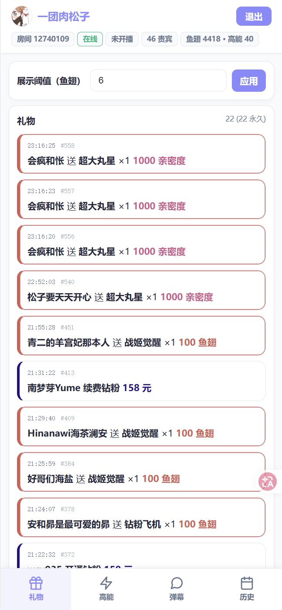
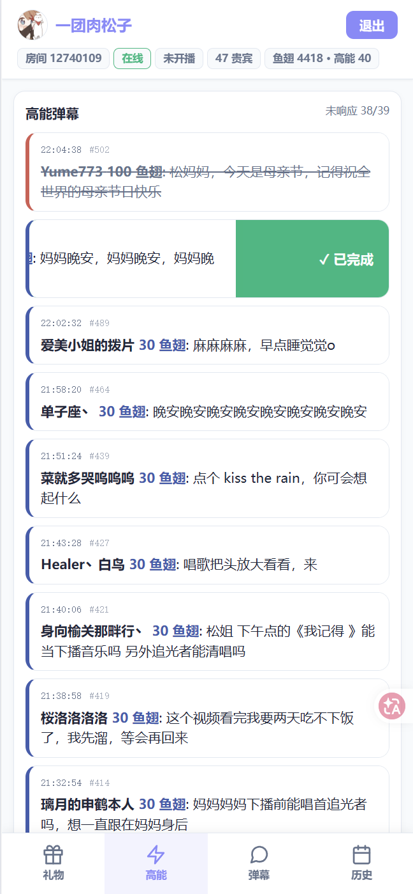

# Hyacinth Sentry (风信子哨兵)

> 一个给斗鱼户外主播自用的"第二屏"小工具——
> 帮你在户外手忙脚乱时不漏掉真正重要的礼物和高能弹幕,下播后还能翻账。
> **Hyacinth Sentry** 代表着如蓝色风信子般的恒久守护：在汹涌的弹幕流中，它像哨兵一样为你捕捉那些闪光的贝壳。

直播间右下角那一片刷屏弹幕谁都看不过来,大礼物连击会被后面的顶走,
高能弹幕里掺杂着大量复读和宝箱派生事件——主播的注意力又往往不在屏幕上。
**Hyacinth Sentry** 不是再做一个弹幕窗口,而是替你**筛信号 + 留底**。

打开手机浏览器、第二台设备、平板——任何一个屏都行,放在视线随手能瞥到的地方就好。

---

## ✨ 它能做什么

### 🎁 礼物 Tab —— 大礼物永远不下沉
- ≥100 鱼翅等效价值的礼物 + 钻粉/贵族订阅 **永久置顶**,飞机/火箭来一发就一直在那
- < 100 鱼翅的礼物自然下沉,30 分钟后从列表淡出(不影响 DB)
- 阈值可调(默认 6 鱼翅起,办卡价值),低于阈值的根本不进列表
- **乾坤袋抽中的亲密度礼物**(抱元守一/超大丸星等)自动按 `亲密度 ÷ 10` 折算等效鱼翅,与同档真鱼翅礼物一个颜色——抱元守一 1000 亲密度 = 钻粉飞机 100 鱼翅,排进同一个金色永久段
- 角标闪烁提醒,排队进来的不会互相挤掉

### ⚡ 高能 Tab —— 一点就标"已响应"
- 主播看完直接**点卡片** = 切换"已响应"状态,半透明灰 + 划线,不消失,可回看
- 顶部固定显示"未响应 N / 共 M",一眼知道还有几个待处理
- 多设备同步:在另一台设备点了 ✓,这台也立刻变化
- 协议层已过滤掉潘多拉宝箱等"零价值高能弹幕"的噪音

### 💬 弹幕 Tab —— 复读自然合并
- 同样内容的弹幕**自动合并**为一条,带 `+N` 计数徽标
- 主播自定义关键词→ 命中后**单独飘红 hold 30 秒**,不会被复读吞掉
- 1 分钟没人再刷的复读自动消失,屏幕永远清爽
- 下方实时显示斗鱼自家的"N 人在说 XXX"热梗

### 📊 历史 Tab —— 下播翻账
- 按日期(凌晨 4 点切分,贴合户外主播作息)查当日高能 + 礼物 + 订阅
- 主播一键导出 CSV(已脱敏 uid),Excel 直接打开

---

## 👀 截图




---

## 🚀 部署 & 运行

### 1. 拉代码并安装依赖

```powershell
git clone https://github.com/LEorEu/hyacinth-sentry-douyu.git
cd hyacinth-sentry-douyu
python -m venv .venv
.\.venv\Scripts\Activate.ps1
pip install -r requirements.txt
```

### 2. 配环境变量

| 变量 | 必填 | 说明 |
|---|---|---|
| `DOUYU_ROOM_ID` | ✅ | 直播间号(URL 末尾的数字) |
| `DOUYU_DB` | 否 | SQLite 文件路径,默认在项目目录下 `events.db` |
| `DOUYU_ADMIN_PASSWORD` | 否 | 主播模式登录密码；未设置时默认 `admin`，公网部署前必须设置 |

### 3. 跑起来

```powershell
$env:DOUYU_ROOM_ID = "输入你要的房间号"
$env:DOUYU_ADMIN_PASSWORD = "设置主播模式的登录密码"
python -m uvicorn hyacinth_sentry.server:app --host 0.0.0.0 --port 3000
```

### 4. 用起来

- 浏览器打开 `http://localhost:3000`,默认观众视图(只读)
- 主播模式:点右上角"登录",输密码进入。密码来自环境变量 `DOUYU_ADMIN_PASSWORD`,未设置时默认 `admin`，公网部署前必须设置
- 同房间观众:把机器 IP:3000 给他们,不登录就看不到 ✓ 状态切换/CSV 导出

### 5. 维护命令

- 维护脚本在 `tools/maintenance/`,排障/取证脚本在 `tools/forensics/`
- 一键清空本地数据库:

```powershell
python -m tools.maintenance.clear_db --yes
```

- `clear_db` 会先备份数据库；如果想让 `VACUUM` 真正回收文件体积，先停服务再执行

---

## 🧰 技术栈

- **后端** — Python 3.11+ · [FastAPI](https://fastapi.tiangolo.com/) · asyncio TCP collector · SQLite (WAL)
- **前端** — Vanilla JS,**零依赖、零构建链**,单 HTML 文件
- **协议** — 直连 `danmuproxy.douyu.com:8601`,匿名采集,多 gid 入组

---

## 🗺️ Roadmap

- ✅ 4 Tab 主结构 + 礼物双段 + 历史导出 + 主播/观众权限
- ✅ 弹幕去重 +N + 关键词置顶 + 热梗下栏
- ✅ 高能弹幕 ✓ 状态切换 + 多设备同步
- ✅ 在线贵宾数(`oni` 帧)+ 简化顶部统计
- ✅ 乾坤袋亲密度礼物显示(抓 pandora API + 等效鱼翅折算)
- ✅ collector 阈值过滤,免费礼物不入 DB(防 ID 自增膨胀)
- ✅ 订阅事件多 gid 去重(钻粉重复 bug 修复)
- ✅ 移动端适配(户外手机第一公民)
- ⏳ 震动通知(`navigator.vibrate`,移动端震动通知，尚未测试)
- ⏳ 高能弹幕自动分类(点歌/视频/任务)

设计笔记保留为本地私有文档,不再随仓库发布。

---

## ❓ 已知问题

- **历史 Tab 看不到亲密度礼物的价格**:`intimacy` 字段不入 DB,只在实时 WS 推送中。历史 Tab 的乾坤袋礼物只能看到名字+数量。要修就加 schema 列 + backfill,优先级低。
- **贵族开通事件未实证**:`anbc` / `rnewbc` 解析路径写了但本环境没触发过,真出现可能要小调。
- **历史查询 limit 500**:无分页,繁忙日子可能截断。
- **乾坤袋奖品池启动时一次性拉**:斗鱼活动期间换皮肤(改 pid)需要重启服务才生效。

---

## 🙏 致谢

- 协议层参考了 [douyu-monitor](https://github.com/qianjiachun/douyu-monitor) 和 [DouyuEx](https://github.com/qianjiachun/douyuEx) 两个开源项目对斗鱼弹幕协议的逆向。

---

## 📄 License

MIT
